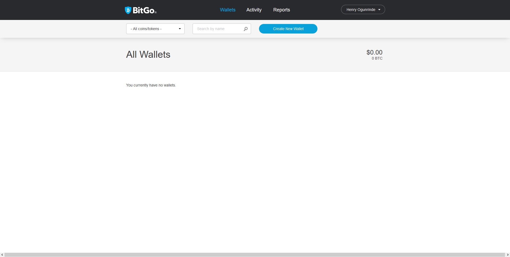

The bitgo configuration file is located at `inc/config.php` which contains all of the well documented options for BitGo coins integration.

### BitGo API 
Generate Long Lived Access Token

- __1)__ Login to the appropriate BitGo dashboard based on the environment you want to setup on.

     > __Test__: Uses testnet chain. Sign up & [Login Here](https://test.bitgo.com/login)

     > __Production__: Uses main chain. Sign up & [Login Here](https://www.bitgo.com/login)


<br>
<br>

- __2)__ Click your account name at the top right, click User Settings.


- __3__ Under Developer Options tab, click on Create Access Token.


- __4)__ Generate a long lived token for your installation on this page.

    (Required) Set the label & live time of your token. You have ten years entered by default.

    (Required) Set the Lifetime Spending Limits of the token. You may set a maximum of 100000000 for all coins.

    (Required) Enter the unique IP address of your server/cpanel use (127.0.0.1) for localhost

    (Required) Grant the token all permissions as shown below


- __5)__ Now. you need to create new wallet address and copy the wallet ID as seen below.


- __6)__ Set your new bitgo credentails on the file `inc/config.php` (Kindly change the wallet id and the bitgo API Key)

```JSON
        /*
        |--------------------------------------------------------------------------
        | BitGo API Key
        |--------------------------------------------------------------------------
        |
        | Your BitGo unique API Key (Should be 69 alphanumeric character long)
        |
        */
        'bitgo_api_key' => 'v2xc4ac6e1d110147ec90a9260d468850ef2b407f93396ddbb7d9d68d26a73c93e7',
        
        /*
        |--------------------------------------------------------------------------
        | BitGo Wllet ID
        |--------------------------------------------------------------------------
        |
        | Your BitGo Wallet ID from the wallet settings
        |
        */
        'wallet_Id' => '5d7aeef0870e5865038a8883ce8cae30',
```

<br>
<br>

### Request Address
You will need to set your cpanel/VPS IP address from line 32 on  the `inc/config.php` file

Example:

```JSON
/*
        |--------------------------------------------------------------------------
        | Website IP ADDRESS
        |--------------------------------------------------------------------------
        |
        | Your website/server ip address. (Leave blank the default value on localhost test)
        |
        */
        'server_ip_address' => '165.22.14.213',
```

### supported Coin
Currently this script supports 25+ cryptocurrencies  and below are the list we have by default at `inc/bitgo/CurrencyCode.php`. 

```PHP 
class CurrencyCode {

    //PRODUCTION
    const BITCOIN = 'btc';
    const BITCOIN_CASH = 'bch';
    const BITCOIN_SV = 'bsv';
    const BITCOIN_GOLD = 'btg';
    const ETHEREUM = 'eth';
    const DASH = 'dash';
    const LITECOIN = 'ltc';
    const RIPPLE = 'xrp';
    const ROYAL_MINT_GOLD = 'rmg';
    const ZCASH = 'zec';
    const STELLAR = 'xlm';
    
    //ERC20 TOKENS
    const ERC = 'erc'; //BitGo’s sample ERC20 token
    const OMISE_GO = 'omg';
    const ZRX = 'zrx'; //0x token
    const FUNFAIR = 'fun';
    const GOLEM = 'gnt';
    const AUGUR_REP = 'rep';
    const BASIC_ATTENTION_TOKEN = 'bat';
    const KYBER_NETWORK = 'knc';
    const CIVIC_REP = 'cvc';
    const EOS = 'eos';
    const QRL = 'qrl';
    const NUMERAIRE = 'nmr';
    const TENXPAY = 'pay';
    const BREAD = 'brd';
    
    //TESTNET
    const BITCOIN_TESTNET = 'tbtc';
    const BITCOIN_CASH_TESTNET = 'tbch';
    const BITCOIN_SV_TESTNET = 'tbsv';
    const ETHEREUM_TESTNET = 'teth';
    const DASH_TESTNET = 'tdash';
    const LITECOIN_TESTNET = 'tltc';
    const ZCASH_TESTNET = 'tzec';
    const RIPPLE_TESTNET = 'txrp';
    const ROYAL_MINT_GOLD_TESTNET = 'trmg';
    const ERC_TESTNET = 'terc';
    const STELLAR_TESTNET = 'txlm';

}

```

List of all supported coin 

```JSON
 'btc', 'bch', 'bsv', 'btg', 'eth', 'dash', 'ltc', 'xlm','xrp', 'zec', 'rmg', 'erc', 'omg', 'zrx', 'fun', 'gnt', 'rep', 'bat', 'knc', 'cvc', 'eos', 'qrl', 'nmr', 'pay', 'brd', 'tbtc', 'tbch', 'tbsv', 'teth', 'tdash', 'tltc', 'txrp', 'tzec', 'trmg', 'terc'

```

### Multi-Coin Feature
This section conver the multi-payment page and kindly ignore if you accepting a single coin on your website. 

First you will need to set list of coin you want to display to user on your multi-coin payment page `multicoin-ajax-index.html` from the config file `inc/config.php`

Example: 
```JSON

/*
|--------------------------------------------------------------------------
| Multi-coin BitGo Coins
|--------------------------------------------------------------------------
| Select the coin what you want to use with the BitGOSDK (use CurrencyCode class to select)
| See supported coin 'btc', 'bch', 'bsv', 'btg', 'dash', 'ltc', 'xrp', 'zec', 'rmg', 'xlm', 'erc', 'omg', 'zrx', 'fun', 'gnt', 'rep', 'bat', 'knc', 'cvc', 
| 'eos', 'qrl', 'nmr', 'pay', 'brd', 'tbtc', 'tbch', 'tbsv', 'tdash', 'tltc', 'txrp', 'tzec', 'trmg', 'terc'
|
*/
'coins'  => array(
  'btc'  => 'Bitcoin',
  'bch'  => 'Bitcoin Cash',
  'ltc'  => 'Litecoin',
  'dash' => 'Dash',
  'xlm'  => 'Stellar',
 ),

```

Then edit and set your selected coin wallet ID as seen below: 
```JSON 
/*
|--------------------------------------------------------------------------
| BitGo Wllet ID For multiple coin only
|--------------------------------------------------------------------------
|
| This section is for multiple coin only.
|
*/

'wallet_btc' => '5ea4ba45f6bf288028f386f13840cd32',
'wallet_ltc' => '5eaa11339e9657d507b0ab532eeee322',
'wallet_bch' => '5eaa1110d2beded00769415e076bb771',
'wallet_dash' => '5ec47e16ed7be31f005487001aa39ff0',
'wallet_xlm' => '5ec5c3224ebdb234003132b1b7f39d01',

```

Follow the above step 5) above to create wallet for each selected coin 

<br><br>

Addtional some coin have different wallet address type and you can easily change the wallet type by modifying your wallet generating request code as seen below:

By default you can run the following command to generate wallet address 
```PHP
$createAddress = $bitgo->createWalletAddress();


```
If you choose to use othe coin such as BCH or DASH your code should look exactly like the below example
```PHP
$createAddress = $bitgo->createWalletAddress(AddressType::LEGACY_DEPOSIT);

```

Addtional coin ZEC coin wallet generating should look exactly like the below example
```PHP
$createAddress = $bitgo->createWalletAddress(AddressType::LEGACY_CHANGE);

```

You can check for other address type options from the following file `inc/bitgo/AddressType.php`


<br>
<br>
<br>