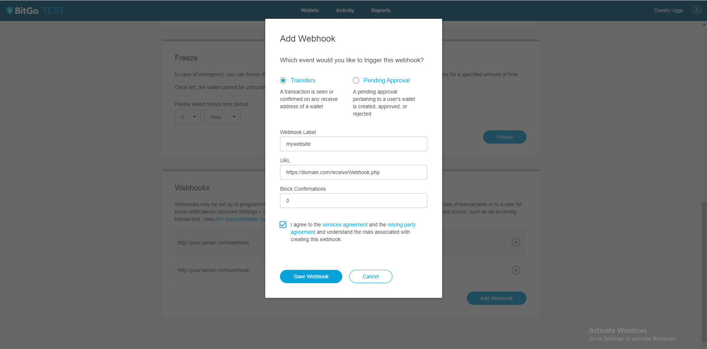
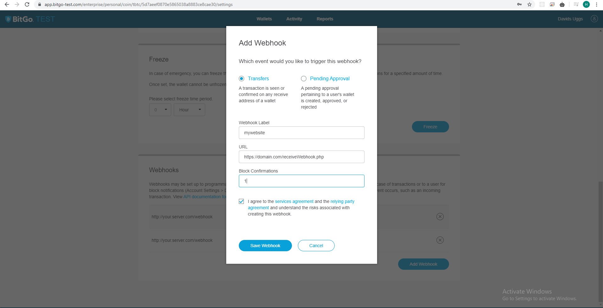

> Webhook notifications are triggered when the specified event occurs, such as an incoming transaction to confirm user payment and update our database automatically and the default file for bitcoin payment integration is file: `receiveWebhook.php`, this section will cover how to create custom Webhook for other cryptocurrencies.

## Creating Webhooks
This is essential because it is used for processing incoming transactions as well as other important background tasks. Transfer webhooks will fire on any transfer on the wallet as callback to update user payment status on your website automatically update payment status on database or send email notifications.

###  Create Programmatically

This feature allow you to create webhook programmatically for a single coin by running the following url http://mywebsite.com/payment/extra/createWalletWebhook.php first edit `inc/config.php` and set url to the url where the script is located. 
For example if you have copied the script files into a directory called "payment" and your website is `http://mywebsite.com` then the url should be set to `http://mywebsite.com/payment`.

<br>

Please Note. make sure you have set your coin type, BitGo API and bitgo enviroment before running the webhook command. see [Configurations](quickstart.md?id=_4-configuration)

Code Example:
```PHP

<?php

require '../inc/init.php';

$coin        = Config::get('app:coin');
$bitGo_api   = Config::get('app:bitgo_api_key');

$bitgo           = new BitGoSDK($bitGo_api, $coin, Config::get('app:bitgo_env') === 'prod' ? false : true ); 
$bitgo->walletId = Config::get('app:wallet_Id');


$url  = Config::get('app:url')."/receiveWebhook.php"; //path to your webhook file receiveWebhook.php update your website url on the config file inc/config.php
$type = "transfer";      //Type of event to listen to (can be 'transfer' or 'pendingaapproval').
$numConfirmations = 0;
$data = $bitgo->addWalletWebhook($url,$type, $numConfirmations);


if (isset($data['state']) &&  !isset($data['error'])) {
	echo 'A wallet webhook has been created for 0 Confirmations<br><br>';
}else{
	echo '1) Whoops! There was an error : '.$data['error'].'<br>';
}


$numConfirmations = 1;
$confirmed = $bitgo->addWalletWebhook($url,$type, $numConfirmations);


if (isset($confirmed['state']) && !isset($confirmed['error'])) {
	echo 'A wallet webhook has been created for 1 Confirmations to update user payment of payment succesfully received and confirmed<br>';
}else{
	echo '2) Whoops! There was an error : '.$data['error'].'<br>';
}

```
### Create WebHooks Maually

> __Test__: Uses testnet chain. Sign up & [Login Here](https://test.bitgo.com/login)

> __Production__: Uses main chain. Sign up & [Login Here](https://www.bitgo.com/login)


- Click on your created wallet login-> wallet -> settings

- __Webhook type__: (transfer)

- Url: Your complete url to webhook file with path EG: `https://domain.com/receiveWebhook.php` or  `https://domain.com/payment/receiveWebhook.php`

- __Block Confirmations__: we are creating two webhooks with the same details (value) the first webhook Block Confirmations is 0 and the second Block Confirmations is 1

 

 

<br>
<br>

> The above screenshot explain how to create your webhooks on the BitGo platform and remeber you need to create two webhooks for a single coin. 
  - The first webhook with 0 confirmations notify your server when bitcoin is sent and still pending confimations from the bitcoin network
  - The second webhook trigger when bitcoin receive 1 confirmation which will mark user invoice as paid or purchase service delivery. 
  - You can actually set any confirmation depends on your choice we recommend 1 confirmation to deliver service faster to your customer

### Multi-Coin WebHooks

This section will explain how to create Miltiple webhooks to accept multi cryptocurrency at time on your website, You may integrate with any preferred coin provider using this feature and preferred coin have to set on the `inc/config.php` file, just fill in your coins and their wallet ID details during the configuration (`inc/config.php`).

However, if you are accepting just single coin on your website we recommend you skip this section and follow the above [referrence](#creating-webhooks).

Create or generating webhook for your coin using the below guideline and examples will easy as you though and your list of webhook depends on the cryptocurrencies you choose to accept.
Example: We assume your `inc/config.php` file look as below example. 

```JSOn
/*
|--------------------------------------------------------------------------
| BitGo Wllet ID For multiple coin only
|--------------------------------------------------------------------------
|
| This section is for multiple coin only.
|
*/

'wallet_btc' => '5ea4ba45f6bf288028f386f13840cd32', //Replac with your own Bitcoin Wallet ID
'wallet_ltc' => '5eaa11339e9657d507b0ab532eeee322', //Replac with your own Litecoin Wallet ID
'wallet_bch' => '5eaa1110d2beded00769415e076bb771', //Replac with your own Bitcoin Cash Wallet ID
'wallet_dash' => '5ec47e16ed7be31f005487001aa39ff0', //Replac with your own Bitcoin Dash ID
'wallet_xlm' => '5ec5c3224ebdb234003132b1b7f39d01', //Replac with your own Bitcoin Stellar ID


/*
|--------------------------------------------------------------------------
| Multi-coin BitGo Coins
|--------------------------------------------------------------------------
| Select the coin what you want to use with the BitGOSDK (use CurrencyCode class to select)
| See supported coin 'btc', 'bch', 'bsv', 'btg', 'dash', 'ltc', 'xrp', 'zec', 'rmg', 'xlm', 'erc', 'omg', 'zrx', 'fun', 'gnt', 'rep', 'bat', 'knc', 'cvc', 
| 'eos', 'qrl', 'nmr', 'pay', 'brd', 'tbtc', 'tbch', 'tbsv', 'tdash', 'tltc', 'txrp', 'tzec', 'trmg', 'terc'
|
*/
'coins'  => array(
  'btc'  => 'Bitcoin',  
  'bch'  => 'Bitcoin Cash',
  'ltc'  => 'Litecoin',
  'dash' => 'Dash',
  'xlm'  => 'Stellar',
 ),


```

Kindly check your config file to replace all wallet id with your own generated id from the BitGo platform . see [Bitgo Wallet Configuration](bitgo.md)


### Webhook Code Example

Guides to create WebHook file for each coin you have set on the config file. 

<br>

For each coin selected you need to create a seperate webhook file receive a webhook notification on your server when payment is receive on the said coin, for example we have btc, bch, ltc, dash and xml our webhook file be be as following. 


		btcReceiveWebhook.php
		ltcReceiveWebhook.php
		bchReceiveWebhook.php
		dashReceiveWebhook.php
		xmlReceiveWebhook.php


Code Example for Litecoin: 

```PHP
<?php


require 'inc/init.php';


// get database connection
$product         = new Product();

$coin        = CurrencyCode::LITECOIN;// Change this to the currency you want to use
$bitGo_api   = Config::get('app:bitgo_api_key');

$bitgo           = new BitGoSDK($bitGo_api, $coin, Config::get('app:bitgo_env') === 'prod' ? false : true ); 
$bitgo->walletId = Config::get('app:bitgo.wallet_'.$coin);


$payload         = $bitgo->getWebhookPayload();

$txDetails       = $bitgo->getWalletTransaction($payload['hash']);


if (isset($txDetails['error'])) {
    exit($txDetails['error']);
}

if (!isset($txDetails['fromWallet']))
{

    foreach ($txDetails['outputs'] as $outputs)
    {
        if (isset($outputs['wallet']))
        {
            $output = ['address' => $outputs['address'], 'value' => $outputs['value']];

            //check if transaction with wallet address exist from the database.
            $wallet = $outputs['address'];
            $CheckStatus = $product->readOne($wallet);

        }

    }

    //Now check if invoice has data
    if (!$CheckStatus)
    {
        return;
    }

    $amountBTC = $bitgo->toBTC($output['value']);     //grab the bitcoin value
    $amountUSD = $bitgo->FormatUSD($amountBTC);       //convert bitcoin value to usd
    $data = ['received' => $amountBTC, 'usdamount' => $amountUSD, 'txid' => $payload['hash'], 'confirmations' => $txDetails['confirmations'], 'address' => $output['address'], ];

    if ($amountBTC > 0 && $txDetails['confirmations'] >= 1)
    {

        /*
        |--------------------------------------------------------------------------
        | Payment confirmed (1 bitcoin confirmation as seen above)
        |--------------------------------------------------------------------------
        |
        | You can write other rules here such as order confirmations, produect delivery, email confirmation
        | 
        |
        | Please see documentation for more information about this section. 
        |
        */


        // set product property values
        $data = [
            'amount'        => $amountBTC,
            'amountUSD'     => $amountUSD, 
            'txtid'         => $data['txid'],
            'dateConfirmed' => date('Y-m-d H:i:s'),
            'dateReceived'  => date('Y-m-d H:i:s'),
            'status'        => 1,

         ];   

        // update the product
        $product->update($data, $data['address']);

    }
    else
    {

        /*
        |--------------------------------------------------------------------------
        | Payment  Pending confirmed (0 Confirmations)
        |--------------------------------------------------------------------------
        |
        | You can write other rules here such as order pending notifications, invoice processed, notification email
        | schemes.
        |
        | Please see documentation for more information about this section. 
        |
        */
        $data = [
            'amount'        => $amountBTC,
            'amountUSD'     => $amountUSD, 
            'txtid'         => $data['txid'],
            'dateConfirmed' => date('Y-m-d H:i:s'),
            'dateReceived'  => date('Y-m-d H:i:s'),
            'status'        => 2,

         ];   
         
        // update the product
        $product->update($data, $data['address']);
    }

}
else
{
  exit('No transaction detected');
    
}


```


We have the litecoin file created by default on the script main folder and you can duplicate the file by chaging the name based on your selected coin. 

### Webhook Debuging

To debug the webhook is easily simple find the code:

```PHP 

//Code Line 31 and line 63
$payload['hash']

```

And replace with the payment long transaction hash:

```PHP
d98502f48ed2f2bca271e162e8f8f09ea8a59a73098640065308e05dde0baac0
``` 

Simple run your WebHook link from the browser EG: `https://domain.com/receiveWebhook.php` or  `https://domain.com/payment/receiveWebhook.php` further more you can use the `var_dump()` function to dump all the json response from the server

```PHP
var_dump($txDetails);

```

### Create Multi-Coin Webhooks
Lastly, make sure  you create your coin webhooks by running the following url after following all the above steps `https://domain.com/payment/extra/createMulticoinWebhook.php` or `https://domain.com/extra/createMulticoinWebhook.php`
this will generate WebHooks for all your selected coin without using the manual process. 

Code Example:

```PHP 
<?php

//file extra/createMulticoinWebhook.php


require '../inc/init.php';


 $coins = Config::get('app:coins');
        foreach ($coins as $key => $coin)
        {

			$bitGo_api   = Config::get('app:bitgo_api_key');

			$bitgo           = new BitGoSDK($bitGo_api, $key, Config::get('app:bitgo_env') === 'prod' ? false : true ); 
			$bitgo->walletId = Config::get('app:wallet_'.$key);


			$url  = Config::get('app:url')."/".$key."ReceiveWebhook.php"; //path to your webhook file receiveWebhook.php update your website url on the config file inc/config.php
			$type = "transfer";      //Type of event to listen to (can be 'transfer' or 'pendingaapproval').
			$numConfirmations = 0;
			$data = $bitgo->addWalletWebhook($url,$type, $numConfirmations);


			if (isset($data['state']) &&  !isset($data['error'])) {
				echo 'A wallet '.$coin.' webhook has been created for 0 Confirmations<br><br>';
			}else{
				echo '1) '.$coin.' Whoops! There was an error : '.$data['error'].'<br>';
			}


			$numConfirmations = 1;
			$confirmed = $bitgo->addWalletWebhook($url,$type, $numConfirmations);


			if (isset($confirmed['state']) && !isset($confirmed['error'])) {
				echo 'A wallet '.$coin.' webhook has been created for 1 Confirmations to update user payment of payment succesfully received and confirmed<br>';
			}else{
				echo '2) '.$coin.' Whoops! There was an error : '.$data['error'].'<br>';
			}


        }

```

<br>
<br>