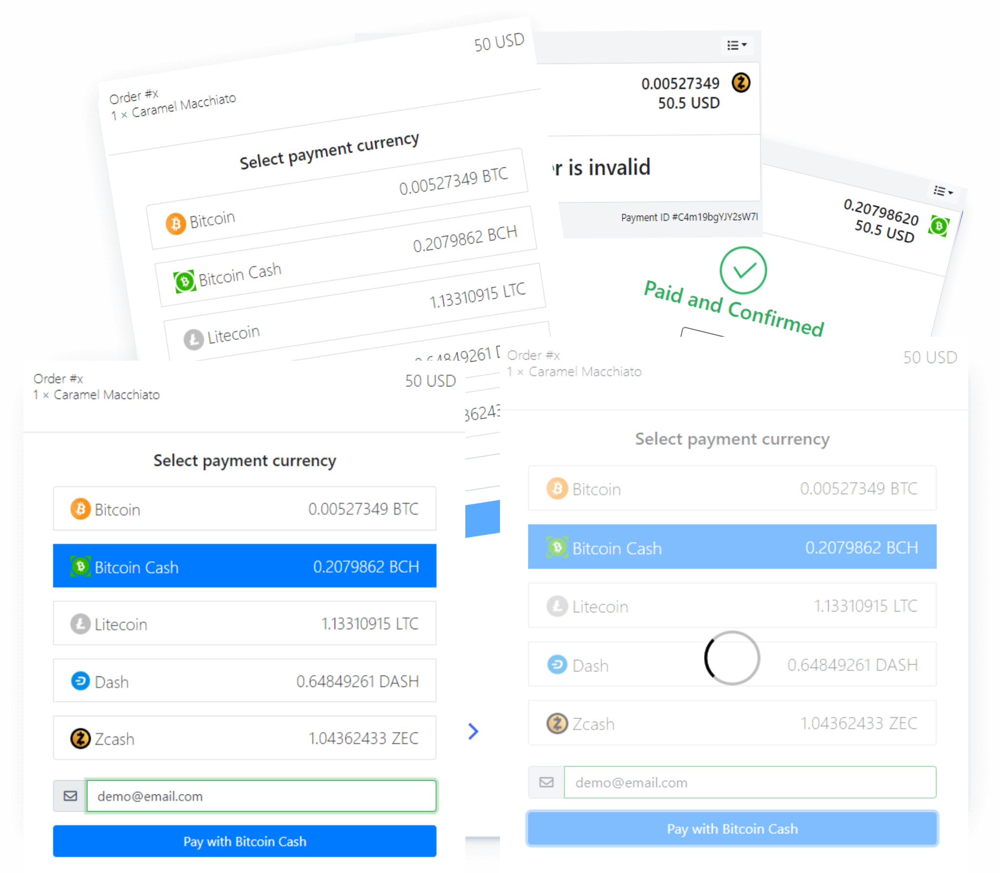

# Multi-Coin Crypto-Payment Gateway

Multi-Coin Crypto-Payment Gateway is a PHP cryptocurrency payment processor based on [BitGo API](https://www.bitgo.com/) which allows you to receive payments in  btc, bch, bsv, btg, dash, ltc, xrp, zec, xlm and ERC20 TOKENS directly on your website with simple integration, with no fees, transaction cost or a middleman.

 
 

__Item Name__ : Multi-Coin Crypto-Payment Gateway

__Item Version__ : v 1.0.3

__Author__ : Maylancer IT LTD

Here, you will find all the necessary information as regards to the installation and usage of the script. Feel free to check the FAQ section, you may discover one or two things which could be of help to you.

## FEATURES
- Direct, peer-to-peer Cryptocurrency payments
- No transaction fees (other than the BitGo Fees)
- No processing fees
- No middleman
- No KYC
- Enhanced privacy
- Self-hosted
- btc, bch, bsv, btg, dash, ltc, xrp, zec, xlm and ERC20 TOKENS support
- WebHook (receive callbacks if payment is made)
- Custom REST API 
- AJAX based
- Invoice System
- Extensive documentation

 
 

- Getting started
  - [Welcome](welcome.md)
  - [Quick start](quickstart.md)
  - [BitGo Configuration](bitgo.md)
  - [WebHooks](webhooks.md)
  - [Restful API](restful.md)
  - [Debugging](debugging.md)